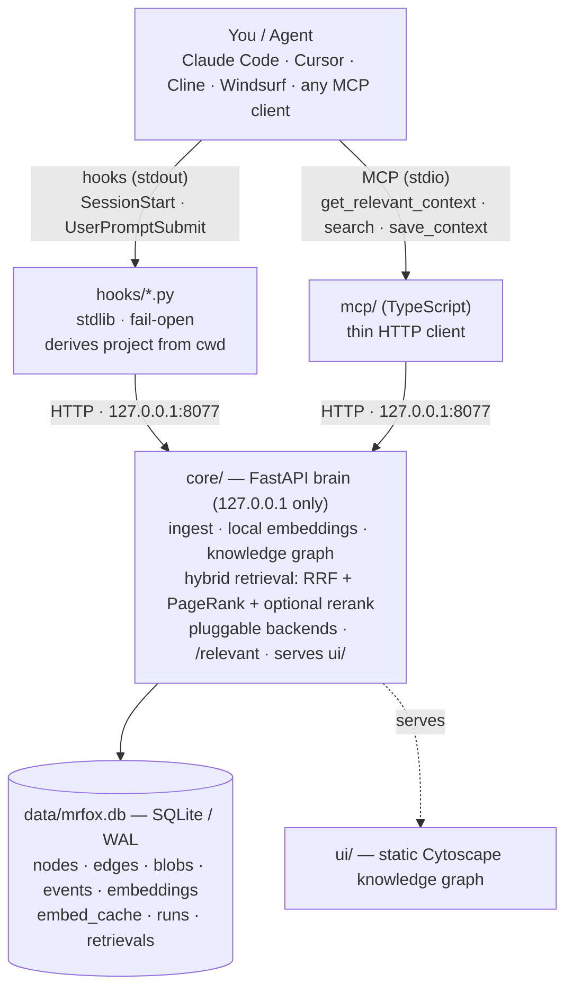

```
 __  __      ______  __   __     __  __      __  __
|  \/  |    |  ____| \ \ / /    |  \/  |    |  \/  |
| \  / |_ __| |__ ___ \ V /_____| \  / | ___| \  / |
| |\/| | '__|  __/ _ \ > <______| |\/| |/ _ \ |\/| |
| |  | | |  | | | (_) / . \     | |  | |  __/ |  | |
|_|  |_|_|  |_|  \___/_/ \_\    |_|  |_|\___|_|  |_|
────────────────────────────────────────────────────
   local-first · code-native memory · zero tokens   
```

**The only fully-local, zero-token AI memory that understands your codebase's _structure_ — not just your chat history.**


MrFoX-MeM ingests a repo, builds a **knowledge graph** of it (files → modules → symbols,
with `imports`/`references` edges), stores everything **locally** (SQLite + local
embeddings), and injects only the *relevant* slice into your agent's prompt. It plugs into
anything you own — Claude Code, Cursor, Cline, Windsurf, or any MCP client.

> **93% fewer tokens.** On this repo, the `/relevant` slice averages **798 tokens** vs
> **~11k** to read the whole files it touches — measured, reproducible: `python scripts/benchmark.py`.

### Why it's different

|                                   | **MrFoX-MeM**                | claude-mem            | mem0            |
|-----------------------------------|------------------------------|-----------------------|-----------------|
| Memory model                      | **code structure (graph)**   | chat/observation log  | personal facts  |
| LLM tokens to *build* memory      | **none — deterministic**     | spends Claude tokens  | required        |
| Runs offline, no API key          | **yes**                      | partial               | no (by default) |
| Prompt-injection-fenced injection | **yes**                      | —                     | —               |
| Multi-language code graph         | **yes (tree-sitter, opt-in)**| —                     | —               |

### Retrieval stack (all local, CPU)

Local embeddings (`fastembed` / bge-small, with a pure-stdlib fallback) **+ FTS5 BM25**,
fused with **Reciprocal Rank Fusion**, expanded by **Personalized PageRank** over the code
graph (HippoRAG-style), reranked by an optional **cross-encoder**, then trimmed to a
**tiktoken-measured budget** — and fenced as untrusted data so an ingested repo can't
prompt-inject your agent.

- **Local-first / private:** your code and all memory stay in `data/mrfox.db` — nothing you
  ingest is ever sent anywhere. The only network touch is a **one-time model download** on
  first run (skip it with the pure-stdlib fallback for a 100% offline install).
- **Zero API tokens for memory ops:** embeddings + ranking run on your CPU — no API, no key.
- **Token-saving by design:** `/relevant` returns a token-bounded block, never whole files.
- **See what got injected:** the UI's Sessions feed shows exactly what each fetch loaded.

---

## Architecture



Components (see `CONTRACT.md` for the binding spec):

| Dir      | What it is                                                              |
|----------|-------------------------------------------------------------------------|
| `core/`  | Python FastAPI brain: store, ingest, embeddings, tree, retrieval, UI.   |
| `mcp/`   | TypeScript MCP server (stdio) — thin client over the core HTTP API.     |
| `ui/`    | Static web UI (Cytoscape.js, no build step) for the knowledge tree.     |
| `hooks/` | Claude Code hook scripts for smart auto-injection + settings snippet.   |

---

## Prerequisites

- **Any OS** — macOS, Linux, or Windows. The `cli.py` launcher is fully cross-platform
  (no `make`/`bash`/`open` needed); `make` and `run.sh` are a Unix convenience, `run.ps1` the
  Windows one.
- **Python 3.11+** and [**uv**](https://docs.astral.sh/uv/) ([install per OS](https://docs.astral.sh/uv/getting-started/installation/)).
- **Node.js 18+** and npm (for the MCP server).
- No API keys, ever. Embeddings, ranking, and storage run locally — the default backend
  downloads a small model once on first run; the stdlib fallback needs no download at all.

---

## Quickstart

> **Any OS, no `make`/`bash`/`curl`:** `python cli.py setup && python cli.py serve-open`.
> The `make` targets below are the Unix convenience path; `run.ps1` is the Windows one.

### 1. Setup (venv + core deps + build MCP server)

```sh
make setup
```

This creates `.venv`, installs `requirements.txt`, then `npm install && npm run build`
in `mcp/` (producing `mcp/dist/server.js`).

### 2. Ingest a project

Start the API (next step) in one terminal, then ingest in another. Ingest goes through the
**HTTP API** (`POST /ingest`) so it stays decoupled from core internals:

```sh
make ingest PATH=/abs/path/to/your/project MRFOX_PROJECT=my-project
```

Ingestion is **static-parse only** — it never executes or imports your code, skips binaries
and oversized files, and **redacts/skips secrets** (`.env`, `*.pem`, `id_rsa`, AWS keys, …).

### 3. Serve the core API + open the UI

```sh
make serve
# then open http://127.0.0.1:8077/  in your browser
```

Or use the all-in-one convenience launcher (starts the API in the background, waits for
`/health`, opens the UI, tails logs, and cleans up on Ctrl-C):

```sh
./run.sh
```

The UI renders the interactive knowledge tree (Cytoscape.js): nodes colored by kind, click a
node for its summary + related events, and a search box that highlights matches.

---

## Register the MCP server

The MCP server is a stdio process that exposes tools (`get_relevant_context`,
`search_knowledge`, `get_knowledge_tree`, `save_context`, `record_decision`) backed by the
core API. Build it first (`make setup`), then register it with your agent.

> Replace `/abs/path/to/MrFoX-MeM` with wherever you cloned it. If your path contains
> spaces, keep it as a single quoted string.

### Claude Code

```sh
claude mcp add mrfox-mem \
  --env MRFOX_API=http://127.0.0.1:8077 \
  --env MRFOX_PROJECT=my-project \
  -- node "/abs/path/to/MrFoX-MeM/mcp/dist/server.js"
```

Verify with `claude mcp list`. Run `make mcp` to launch the server standalone for debugging.

### Cursor

Add to `~/.cursor/mcp.json` (or the project's `.cursor/mcp.json`):

```json
{
  "mcpServers": {
    "mrfox-mem": {
      "command": "node",
      "args": ["/abs/path/to/MrFoX-MeM/mcp/dist/server.js"],
      "env": {
        "MRFOX_API": "http://127.0.0.1:8077",
        "MRFOX_PROJECT": "my-project"
      }
    }
  }
}
```

### Windsurf · GitHub Copilot · Gemini CLI · Cline · others

The MCP server is client- and OS-agnostic — the same `node .../mcp/dist/server.js` + two env
vars work everywhere; only the **config file location and root key differ** per client
(e.g. Copilot/VS Code uses root key `servers`, not `mcpServers`). Copy-paste, web-verified
registration for **all five clients** on macOS / Linux / Windows:

> **→ `integrations/MCP-CLIENTS.md`** — exact config path + JSON/CLI per client, per OS.

**Smart auto-injection beyond Claude Code:** only Claude Code has a hook system, so only it gets
*fully automatic* context injection (below). For Cursor / Copilot / Gemini CLI / Windsurf, ship a
small **native rules file** that tells the agent to call the `get_relevant_context` MCP tool at the
start of a task (and `save_context` on decisions). Ready-made templates + where each goes:

> **→ `integrations/AUTO-CONTEXT.md`** and **`integrations/rules/`** (cursor.mdc,
> copilot-instructions.md, GEMINI.md, windsurf.md, CLAUDE.snippet.md).

---

## Wire the Claude Code hooks (smart auto-injection)

The hooks call `/relevant` and print a token-bounded context block to stdout, which Claude
Code injects:

- **`hooks/session_start.py`** — on **SessionStart**: detects your git branch + recent commit
  subjects, synthesizes a prompt, asks `/relevant` (budget ≈ 800 tokens), prints the context.
- **`hooks/user_prompt.py`** — on **UserPromptSubmit**: reads the prompt from the hook's JSON
  stdin, asks `/relevant?...&budget_tokens=1200`, prints the context.

Both **fail open**: if the API is down they exit 0 silently and never block your session.

To wire them, copy the `hooks` block from `hooks/settings.snippet.json` into your
`.claude/settings.json` (project-level `<project>/.claude/settings.json`, or user-level
`~/.claude/settings.json`) and **adjust the absolute paths**:

```jsonc
{
  "env": {
    "MRFOX_API": "http://127.0.0.1:8077",
    "MRFOX_PROJECT": "my-project"
  },
  "hooks": {
    "SessionStart": [
      { "hooks": [ { "type": "command",
        "command": "python3 '/abs/path/to/MrFoX-MeM/hooks/session_start.py'",
        "timeout": 10 } ] }
    ],
    "UserPromptSubmit": [
      { "hooks": [ { "type": "command",
        "command": "python3 '/abs/path/to/MrFoX-MeM/hooks/user_prompt.py'",
        "timeout": 10 } ] }
    ]
  }
}
```

The hooks read `MRFOX_API` and `MRFOX_PROJECT` from the environment — set them in the snippet's
`env` block (above) or in your shell. See `.env.example`.

---

## See what gets fetched — the Sessions feed

Every time an agent starts a conversation or sends a prompt, MrFoX-MeM records the fetch and
shows it to you in the UI's **Sessions** tab — so you can *see* exactly what memory was loaded,
not just trust that something happened.

- **Live feed** — each `/relevant` fetch appears as an entry: the trigger (session-start /
  prompt / mcp / ui), the prompt, the token count, and which knowledge-tree nodes + past
  decisions were injected. Click an entry to light up those nodes in the graph. The feed
  auto-refreshes (~3s) while the tab is open, and pauses when it isn't.
- **Runs** — a *run* groups one conversation's fetches and saved decisions into a single
  timeline (the lightweight "workflow" view). The SessionStart hook opens a run per
  conversation; later prompts and saved decisions attach to it.

Under the hood this is backed by `GET /retrievals`, `GET /runs`, and `GET /run/{id}`, with
fetches logged automatically by `/relevant` (see `CONTRACT-FEED.md`). Nothing here costs LLM
tokens — it's all local.

---

## Make targets

| Target                          | Does                                                          |
|---------------------------------|--------------------------------------------------------------|
| `make setup`                    | `uv venv` + install core deps + `npm install && npm run build` |
| `make serve`                    | run core API: `uvicorn core.api:app --host 127.0.0.1 --port 8077` |
| `make ingest PATH=/abs/dir`     | `POST /ingest` for a project dir via `curl` (`DIR=` also works) |
| `make mcp`                      | run `node mcp/dist/server.js`                                |
| `make clean`                    | remove venv, `node_modules`, `dist`, `__pycache__`, `data/*.db` |

---

## Extending it (pluggable backends)

Embedders and rerankers register behind stable `Protocol` interfaces
(`core/backends.py`), selected by capability with graceful fallback — new models
are drop-ins, no core edits:

```python
from core import backends

@backends.register("embedder", "my-model")
def _make():
    return MyEmbedder()   # anything with .backend, .dim, and .embed(texts)
```

Pick a backend at runtime without touching code (first that loads wins):

```sh
MRFOX_EMBEDDER=hashing        # or e.g. "fastembed,hashing"
MRFOX_RERANKER=fastembed      # reranker is OFF by default (see scripts/eval.py)
```

`GET /health` lists what's registered. The same registry will host vector-index
(sqlite-vec/usearch) and language-parser backends.

---

## Ship it to another machine

Everything is path-relative or derived — no per-machine source edits beyond where you clone it.

**1. Clone + setup (macOS / Linux / Windows):**
```sh
git clone <repo-url> MrFoX-MeM && cd MrFoX-MeM
python cli.py setup            # venv + deps + builds the MCP server   (or: make setup)
```

**2. Run the server** — foreground or as an always-on service:
```sh
python cli.py serve                 # foreground (or: make serve)
bash scripts/install-service.sh     # background service: macOS launchd / Linux systemd --user
```
> macOS: the service logs to `/tmp` on purpose — a repo under `~/Documents` or `~/Desktop` is
> TCC-protected, so launchd cannot open a log file there (fails with `EX_CONFIG`/78).

**3. Make it available to your agents:**
```sh
# Global MCP — every project, tools on-demand, project derived from the directory:
claude mcp add mrfox-mem -s user --env MRFOX_API=http://127.0.0.1:8077 \
  -- node "$PWD/mcp/dist/server.js"

# Slash command usable in any repo (type /mrfox-mem in Claude Code):
cp integrations/commands/mrfox-mem.md ~/.claude/commands/mrfox-mem.md
```

**4. Ingest a project (opt-in per repo):**
```sh
cd /path/to/project && /mrfox-mem          # in Claude Code (ingests the current dir)
# or from a shell:
make ingest PATH=/path/to/project MRFOX_PROJECT=name
```

**5. (Optional) automatic per-prompt injection** — copy `integrations/` templates
(`.mcp.json` + `.claude/settings.json`) into a repo, or add the SessionStart /
UserPromptSubmit hooks to `~/.claude/settings.json` globally. The hooks derive the
project from the directory, so one global install serves every repo. (If you already
run another always-on memory injector, prefer per-project to avoid double-injection.)

### Environment knobs (all optional)
| Var | Default | Effect |
|---|---|---|
| `MRFOX_API` | `http://127.0.0.1:8077` | core API base (loopback only) |
| `MRFOX_PROJECT` | *(derived)* | pin the project; unset → slug of the git-root/cwd basename |
| `MRFOX_PORT` | `8077` | server port |
| `MRFOX_EMBEDDER` | `fastembed,hashing` | embedder preference order |
| `MRFOX_RERANKER` | `fastembed,none` | reranker preference (off by default) |
| `MRFOX_ALLOWED_ROOTS` | *(none)* | confine ingest to these roots (`os.pathsep`-separated) |

---

## Security notes

MrFoX-MeM is a single-user, **localhost-only** tool. Security is built in, not bolted on:

- **Bind to `127.0.0.1` only** — never `0.0.0.0`. No auth is required precisely because nothing
  listens off-host. Do not expose the port or point `MRFOX_API` at a non-localhost address.
- **CORS** is locked to `localhost` / `127.0.0.1`.
- **Secret-redaction on ingest:** files matching secret patterns (`.env`, `*.pem`, `id_rsa`,
  AWS keys, …) are skipped/redacted; raw secret values are never stored in summaries or blobs.
- **No code execution:** ingestion is static-parse only — it never imports/executes project
  code, and there is no `eval`/`exec` on file content or user input. SQL is parameterized.
- **Path safety:** `/ingest` validates the path (absolute, exists, is a directory) and rejects
  symlink escapes / arbitrary FS traversal.
- **Resource caps:** max file size, max file count, binary-skip — to bound resource use.
- **Hooks are fail-open and safe:** stdlib only, `subprocess.run([...], shell=False, timeout=…)`
  for git, no `eval`/`exec` of untrusted content, capped output, and they never log secrets.

---

See `CONTRACT.md` for the full API surface, schema, and component contracts.
